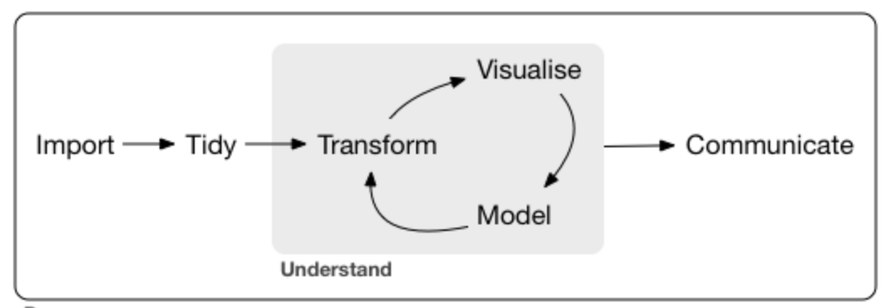

```{r setup, include=FALSE}
knitr::opts_chunk$set(echo = TRUE)
```

#Open Skill data science skills analysis

Use data in Open Skills web site to find job titles with Data Science skills.  
Data from site to be used is clean_title_count


Use tidy workflow to produce analysis:     




##Libraries

```{r message=FALSE}
library(RCurl)
library(dplyr)
library(tidyr)
library(rvest)
library(stringr)
library(ggplot2)
library(kableExtra)
library(RMySQL)
library(wordcloud2)
```

##Import

###Get list of csv files to import from Open Skills website

```{r}
csvFiles<-read_html("https://open-skills-datasets.s3-us-west-2.amazonaws.com/") %>% html_nodes("key") %>% html_text() %>% str_extract("cleaned_title_count/[:print:]+") %>% str_extract("[0-9]+Q[1-4].csv")
csvFiles<-csvFiles[!is.na(csvFiles)] 
csvFiles %>% kable(align = 'c') %>% kable_styling() %>% scroll_box(width = "300px",height="400px") %>% kable_styling(position = "center") 
```

###Load last 4 csv files - last year worth of data

```{r}
out<-vector()
for (i in 0:3) {
  url<-paste("https://open-skills-datasets.s3-us-west-2.amazonaws.com/cleaned_title_count/",csvFiles[length(csvFiles)-i],sep="") 
  x<-getURL(url)
  out<-rbind(out,read.csv(textConnection(x)))
}
dataTable<-tbl_df(out)
head(dataTable,n=20) %>% kable() %>% kable_styling() %>% scroll_box(width = "910px",height="400px")
```

##Tidy

###Build long tables for skills and jobs

```{r}
#Get skills
skills <- dataTable %>%select( starts_with('skill') )    %>%
  gather(3:10,  value = "skill") %>%
  select( starts_with('skill')) %>% 
  distinct() %>% 
  filter(skill != '')
#Get job titles 
jobs <- dataTable %>%select( 1)  %>%
  filter(title != '')   %>% 
  distinct()  
 names(jobs)<-c('job_name')
 names(skills) <- c('skill_name')
head(jobs,n=20) %>% kable() %>% kable_styling() %>% scroll_box(width = "910px",height="400px")
head(skills,n=20) %>% kable() %>% kable_styling() %>% scroll_box(width = "910px",height="400px")
```

###Save skills and jobs to DB

```{r}
con = dbConnect(MySQL(), user='data607p3', password='data607p3', dbname='job_skills', host='localhost')

########################################################################
#only run this once otherwise tables will have duplicate data
#RMySQL::dbWriteTable(con, 'jobs', jobs, append = TRUE, row.names = FALSE)
#RMySQL::dbWriteTable(con, 'skills', skills, append = TRUE, row.names = FALSE)
#########################################################################
```

###Read jobs and skills back

We are using auto increment id column for primary key so we need to read the tables back to do the mapping table

```{r}
job_db <- dbReadTable(con, 'jobs')
skills_db<- dbReadTable(con, 'skills')
head(job_db,n=20) %>% kable() %>% kable_styling() %>% scroll_box(width = "910px",height="400px")
head(skills_db,n=20) %>% kable() %>% kable_styling() %>% scroll_box(width = "910px",height="400px")
```

###Tidy & Transform job to skills mapping then save it to db

```{r}
job_skills <-  dataTable   %>%
  gather(3:10,  value = "skill_name", key="job_name") %>%
  filter(skill_name != '') %>%
  filter(title != '') %>%
  select(title, skill_name)%>%
  as.data.frame()

names(job_skills) <- c('job_name','skill_name')
head(job_skills,n=20) %>% kable() %>% kable_styling() %>% scroll_box(width = "910px",height="400px")

# save jobs_skills mapping. we are doing this because we have auto increment private keys.
job_skills_map <- job_skills %>%
                  inner_join(skills_db )  %>%
                  inner_join(job_db )   %>%
                  select(job_id, skill_id) %>%
                  distinct()
```


#Question 1 - What are the most important skills in Data Science?

##Transform

Filter table for data science titles only

```{r}
job_skills_dataScience<-filter(job_skills,str_detect(job_name,"data scientist"))
head(job_skills_dataScience,n=20) %>% kable() %>% kable_styling() %>% scroll_box(width = "910px",height="400px")
```

Create a vector with all skills

```{r}
skillsDataScience<-pull(job_skills_dataScience,'skill_name')
skillsDataScience<-table(skillsDataScience)
head(skillsDataScience,n=10) %>% kable() %>% kable_styling() %>% scroll_box(width = "910px",height="400px")
```

##Visualize

Order data then visualize using ggplot

Also we plot a word soup using wordcloud2 package


```{r fig.width=10}
skillsDataScienceOrdered<-skillsDataScience %>% as.data.frame() %>% tbl_df()
skillsDataScienceOrdered$skillsDataScience <- factor(skillsDataScienceOrdered$skillsDataScience,levels=skillsDataScienceOrdered$skillsDataScience[order(-skillsDataScienceOrdered$Freq)])

ggplot(skillsDataScienceOrdered,aes(x=skillsDataScience,y=Freq))+geom_bar(stat="identity")+theme(axis.text = element_text(angle=90))

wordcloud2(skillsDataScienceOrdered,shuffle = TRUE,size = .5,gridSize = 15)
```

#Question 2 - What Data Science job tittles require the most skills?

##Transform

Same as in question 1 we filter our long tidy table for data science titles only, but this time we group them

```{r}
job_skills_dataScience<-filter(job_skills,str_detect(job_name,"data scientist")) %>% group_by(job_name) %>% count()
head(job_skills_dataScience,n=20) %>% kable() %>% kable_styling() %>% scroll_box(width = "910px",height="400px")
```

##Visualize

We order data and visualize using ggplot

```{r fig.height=8,fig.width=10}

skillsDataScienceOrdered<-job_skills_dataScience
skillsDataScienceOrdered$job_name <- factor(skillsDataScienceOrdered$job_name,levels=skillsDataScienceOrdered$job_name[order(-skillsDataScienceOrdered$n)])

ggplot(skillsDataScienceOrdered,aes(x=job_name,y=n))+geom_bar(stat="identity")+theme(axis.text = element_text(angle=90))
```


#Question 3 - What other job titles have similar skills to Data Science? 

##Transform

Once again we filter data scientist, and then we do a join with all other job names to find those with similar skills


```{r}
job_skills_dataScience<-filter(job_skills,str_detect(job_name,"data scientist"))
job_skills_dataScience<-job_skills_dataScience %>% filter(skill_name!='skill')
same_skills<-job_skills %>% right_join(job_skills_dataScience,by='skill_name') %>% subset(!(job_name.x %in% job_skills_dataScience$job_name)) %>% group_by(job_name.x) %>% count()
```

##Visualize

We order and visualize the data using ggplot

```{r fig.height=8,fig.width=10}
same_skills_Ordered<-same_skills %>% filter(n>550) %>% as.data.frame() %>% tbl_df()
same_skills_Ordered$job_name <- factor(same_skills_Ordered$job_name.x,levels=same_skills_Ordered$job_name.x[order(-same_skills_Ordered$n)])

ggplot(same_skills_Ordered,aes(x=job_name,y=n))+geom_bar(stat="identity")+theme(axis.text = element_text(angle=90))
```

#Question 4 - What percentage of people have the skills to be a Data Scientist?

We define a model in which:
- A random person has 10 random skills from the list of possible skills in the dataset
- A person with more than 5 data science skills has the skills to be a data scientist

With this model, we test out 1000 random people and calculate a percentage

```{r}
skill_all<-job_skills$skill_name
skill_datascience<-job_skills_dataScience$skill_name
skill_not_datascience<-setdiff(job_skills$skill_name,skill_datascience)

number_of_data_sientists<-0
people_in_population<-1000
for (i in 1:people_in_population) {
  person<-skill_all[as.integer(runif(10,0,length(skill_all)))]
  if (length(setdiff(person,skill_datascience))>5) {
    #print(paste("Person",toString(i),"has skills to be a data scientist"))
    number_of_data_sientists<-number_of_data_sientists+1
  } else {
    #print(paste("Person",toString(i),"does not skills to be a data scientist"))
  }
}
proportion<-number_of_data_sientists/people_in_population*100
print(paste("The percentage of people with data science skills is: ",toString(proportion),"%",sep=""))

result<-as.data.frame(c(100-proportion,proportion))
colnames(result)<-c("Percentage")
result$Skill_Set<-c("Non Data Science","Data Science")
ggplot(result,aes(y=Percentage,x=Skill_Set,fill=Skill_Set))+geom_bar(stat="identity")+geom_text(data=result,aes(y=Percentage,x=Skill_Set,label=paste(Percentage,"%",sep="")))

```


